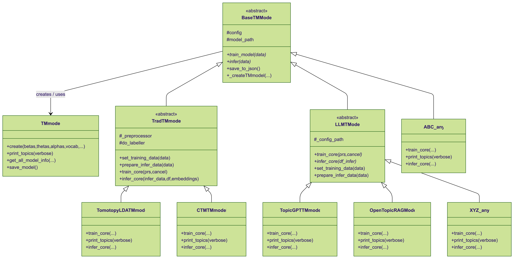

# TOVA: Topic Visualization & Analysis

## Functionalities

1. Train traditional models (Tomotopy LDA, CTM) or LLM-based models (TopicGPT, OpenTopicRAG) from CLI or web under a common pattern, with a plug-in architecture that lets you extend TOVA with new topic-model classes easily (see class diagram below).
2. Explore trained models via the dashboard: topic lists, top documents, coherence metrics, and similar-topic suggestions.
3. Run inference on new corpora and download topic assignments/theta matrices.

<div align="center">
  
</div>

## Deployment options

### 1. CLI / local scripts

Use the CLI entry points directly from your workstation:

```bash
python3 -m venv .venv && source .venv/bin/activate
pip install --upgrade pip
pip install -e .            # installs the project defined in pyproject.toml
```

#### Example CLI invocation

```bash
python -m src.tova.cli.main train run \
 --model tomotopyLDA \
 --data data_test/bills_sample_100.csv \
 --text-col tokenized_text \
 --output data/models/tomotopy
    --tr-params '{"num_topics": 10, "num_iters": 50}'
```

This uses the package metadata declared in `pyproject.toml` (`[tool.setuptools]`, dynamic dependencies, and optional extras) so everything required for CLI usage is installed automatically.

### 2. Python package (library) usage

To embed TOVA inside another project, add it as a dependency and install via pip:

```bash
pip install git+https://github.com/daniel-stephens/TOVA.git@master
```

or build a wheel with `python -m build --wheel`. The resulting package exposes the modules under `tova.*`, so you can import and orchestrate training/inference programmatically. Extras defined in `pyproject.toml` (for example `pip install .[ui]`) install the UI or Solr-specific requirements.

### 3. Docker / web service deployment (Makefile-driven)

Everything for containerized deployment happens through the Makefile that wraps `docker compose`. The Makefile targets are not needed for CLI/package usage; they exclusively orchestrate the Docker-based stack.

**Quick start**

1. Create `.env`:

 ```bash
 VERSION=0.1.0
 ASSETS_DATE=20240601
 ```

1. Kick off the stack:

 ```bash
 make up        # build and start api, web, postgres, solr, solr-api, zoo
 make down      # stop and remove all containers
 make logs-api  # follow API logs
 ```

**Building images**

- `make build` (use `make rebuild-all` for no-cache) – build builder, assets, api, web, solr-api images
- `make build-api` (`make rebuild-api`) – build only the API image
- `make build-web` (`make rebuild-web`) – build only the web UI image
- `make build-solr-api` (`make rebuild-solr-api`) – build only the Solr API image
- `make rebuild-run` – rebuild runtime services (api, web, solr-api) and start them

**Running services**

- `make up` – build (if needed) and start everything
- `make down` – stop and remove containers

**Monitoring**

- `make logs-api` – stream API logs
- `make logs-web` – stream web UI logs
- `make logs-solr-api` – stream Solr API logs

### Services

The application consists of:

- **API** (port 8000) - Main FastAPI application
- **Web** (port 8080) - Web UI interface
- **Solr API** (port 8001) - Solr search interface
- **Solr** (port 8983) - Apache Solr search engine
- **Postgres** (port 5432) - Persistent metadata storage for user information
- **Zookeeper** (ports 2180, 2181) - Coordination service for Solr

## Configuration 

The main configuration file is `static/config/config.yaml`. It aggregates:

- **LLM connectivity** (`llm`): providers, API keys, reachable hosts, and model allowlists.
- **Topic modeling defaults** (`topic_modeling.general`): shared options like `llm_provider`, prompts, and topic counts.
- **Per-model blocks** (`topic_modeling.traditional`, `topic_modeling.llm_based`, `opentopicrag`, `topicgpt`, etc.) that override or extend the defaults.

### LLM configuration

Large Language Models are configured through the `llm` section. Example:

```yaml
# Global LLM connectivity: define API keys, hosts and model names for every provider the system may call.
llm:
  gpt: # OpenAI / Azure OpenAI settings
    path_api_key: OPENAI_API_KEY  # env var name read at runtime
    available_models: {...} # available models for this deployment type
  ollama: # Local Ollama endpoint exposed to containers
    host: http://0.0.0.0:11434 # bind Ollama externally so Docker can reach it
    available_models: {...}

# LLM provider/model references used during training (LLM-based models) or optional label/summarization helpers for traditional models
topic_modeling:
    general:
        llm_provider: "ollama"
        llm_model_type: "gemma3:4b"
        llm_server: "http://kumo01.tsc.uc3m.es:11434"
```

- **OpenAI / Azure OpenAI** – save `OPENAI_API_KEY` (or whatever `api_key_env` names) in your `.env` file before invoking the CLI or starting Docker.
- **Ollama** – when running inside Docker, the Ollama HTTP endpoint must be reachable from the containers. Launch Ollama with `ollama serve --host 0.0.0.0 --port 11434` and update `llm.ollama.host` to an address visible from the API container (e.g. `http://0.0.0.0:11434`).
- Update `opentopicrag` / `topicgpt` sections to point to custom prompts, samples, or iterations before starting jobs.
